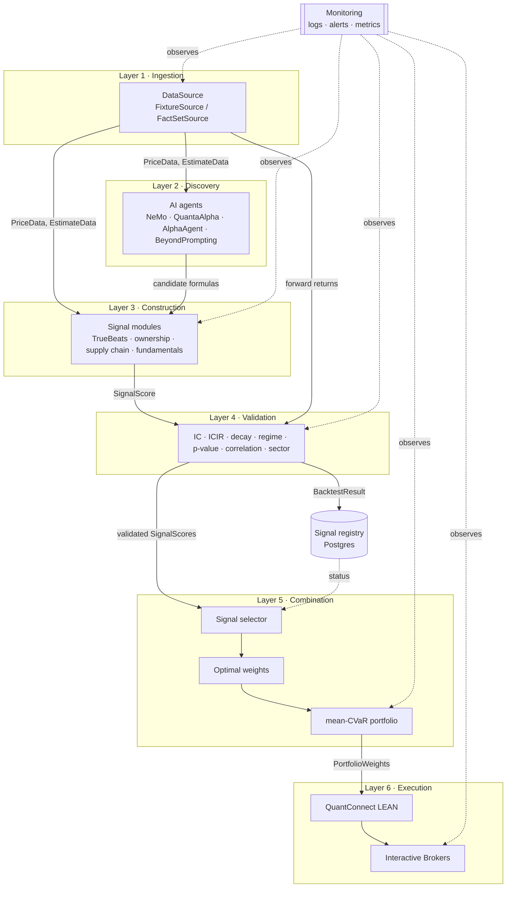

# Architecture

How the whole system fits together, in plain English. Read this first.

## System overview

The platform turns raw institutional financial data into live trade orders through six
strictly-separated layers. Data moves **forward only**, validated at every boundary by a
Pydantic data contract (see [DATA_CONTRACTS.md](DATA_CONTRACTS.md)). Nothing reads global
state; every module receives data through function parameters and returns data through
return values. The only permitted side effects are logging and database writes
(the Golden Rule — see [PRINCIPLES.md](PRINCIPLES.md)).

Concretely, the journey of one trade idea:

1. **Ingestion.** A `DataSource` returns point-in-time prices and analyst estimates as
   validated `PriceData` / `EstimateData` objects. In development this is `FixtureSource`
   (deterministic synthetic data, no credentials); in production it is `FactSetSource`.
2. **Discovery.** AI agents propose candidate signal *formulas* (operators over the data).
3. **Construction.** Hand-built signals (e.g. TrueBeats) compute a `SignalScore` per
   ticker per day from the ingested data.
4. **Validation.** Each signal is judged: IC, ICIR, decay, regime stability, a p-hacking
   guard, correlation against existing signals, and sector-neutrality — producing a
   `BacktestResult` with `passed_validation`.
5. **Combination.** Surviving signals are de-duplicated, optimally weighted, and turned
   into `PortfolioWeights` via mean-CVaR optimization subject to constraints.
6. **Execution.** Weights flow to a QuantConnect LEAN algorithm, which paper-trades and
   eventually routes live orders to Interactive Brokers.

Monitoring observes every layer (IC tracking, P&L, pipeline health, alerts) but **nothing
depends on it** — it is a horizontal concern.

## The six layers

| Layer | Responsibility | Input → Output | Code |
|------:|----------------|----------------|------|
| 1. Ingestion | Pull & validate point-in-time data | API/fixtures → `PriceData`, `EstimateData` | `src/data/` |
| 2. Discovery | AI-proposed candidate signal formulas | data → candidate formulas | `src/signals/discovery/` |
| 3. Construction | Build hand-crafted signals | data → `SignalScore` | `src/signals/construction/` |
| 4. Validation | Judge a signal rigorously | `SignalScore` + forward returns → `BacktestResult` | `src/signals/validation/` |
| 5. Combination | De-dup, weight, build portfolio | `BacktestResult`s + scores → `PortfolioWeights` | `src/signals/combination/`, `src/portfolio/` |
| 6. Execution | Backtest → paper → live | `PortfolioWeights` → orders | `src/execution/` |

## Data flow

Every arrow is labeled with the **data contract** it carries. If a payload does not match
the contract, the system raises immediately rather than passing bad data downstream.

## Module dependency rules

Dependencies point **downward only**. A violation is a review-blocking bug.

- `src/data/**` depends on nothing but `src/data/contracts` and `src/utils`. It has **no**
  knowledge of signals, portfolio, or execution.
- `src/signals/construction/**` and `discovery/**` depend only on `src/data/**` and
  `src/utils`.
- `src/signals/validation/**` depends on signal outputs and data.
- `src/signals/combination/**` and `src/portfolio/**` depend on validation outputs only.
- `src/execution/**` is downstream of everything.
- `src/monitoring/**` may import from anywhere, but **nothing imports from monitoring**
  except to obtain a logger. (Importing the logger is allowed everywhere; it is a leaf.)
- `config/settings.py` is the single source of configuration; it imports nothing from
  `src/`.

## The `DataSource` abstraction

Layer 1 is fronted by an abstract `DataSource` (`src/data/source/base.py`) with two
implementations:

- **`FixtureSource`** — deterministic synthetic data, no credentials. Used by all unit
  tests and local development. Records are tagged `data_source="fixture"`,
  `point_in_time=True`, and can never be mistaken for licensed production data.
- **`FactSetSource`** *(Milestone 2)* — the real FactSet-backed implementation.

Which one is used is decided by `DATA_SOURCE` in the environment, resolved by
`get_data_source()`. This keeps Layers 2–6 fully buildable and testable **before** FactSet
API access is in hand, and prevents any module from coupling to a specific vendor.

## The Golden Rule

> Every module receives data through its function parameters and returns data through its
> return values. No module reads from global state. No module modifies shared state. The
> only side effects are logging and database writes.

This is what makes the system testable, reproducible, and reversible.

## Component reality check

The design brief names several "engines." Be precise about what is a real, installable
tool versus a *methodology we implement ourselves* — so we never design around an SDK that
does not exist.

| Component | Reality |
|-----------|---------|
| NVIDIA NeMo Agent Toolkit | Real, installable (build.nvidia.com / NIM). |
| NVIDIA cuOpt | Real LP/MILP solver. We formulate mean-CVaR as an LP (Rockafellar-Uryasev); `cvxpy` is the pragmatic fallback. cuOpt is **not** a portfolio optimizer. |
| QuantConnect LEAN | Real, open-source. |
| Interactive Brokers API | Real. |
| FactSet TrueBeats | A real FactSet **product**. Our `truebeats.py` re-implements the published Vinesh Jha methodology from FactSet's blog — it is our own code. |
| FactSet "Signal Selector / Optimal Weights" | A FactSet **Workstation** feature, **not** an API. We implement the equivalent ourselves. |
| AlphaAgent | A published method (arXiv). We implement it; no SDK. |
| QuantaAlpha, MadEvolve, "Beyond Prompting" | Treated as **methodologies we implement**. We could not verify these as real named, installable tools. The corresponding `runner.py` files are clean interfaces plus our own implementations. |

Discovery modules (`src/signals/discovery/**`) are therefore interfaces over our own
implementations, not thin wrappers around vendor SDKs.

## Build order & milestones

See the project brief's milestone list. Milestone 1 (this foundation) is complete:
scaffold, docs, data contracts, settings, logging, and the `DataSource` abstraction with
the fixture mock, all tested. Subsequent milestones fill the stub modules one at a time —
build the module, write the tests, make them pass, then move on.
